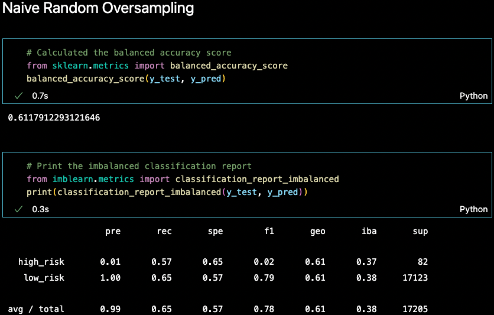
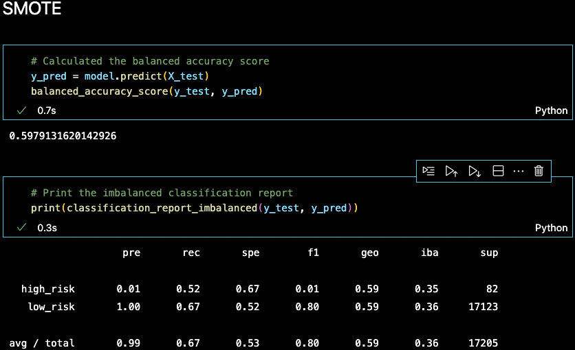
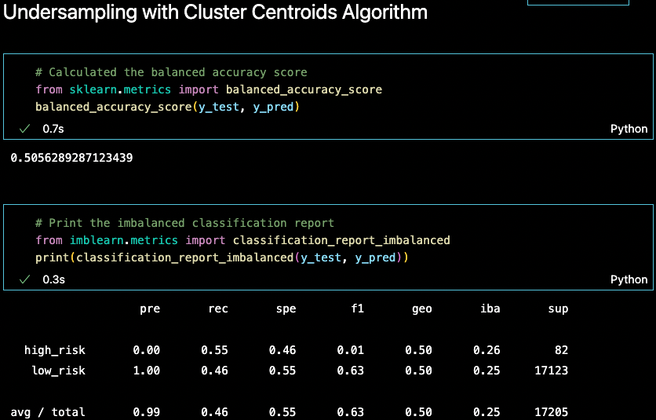
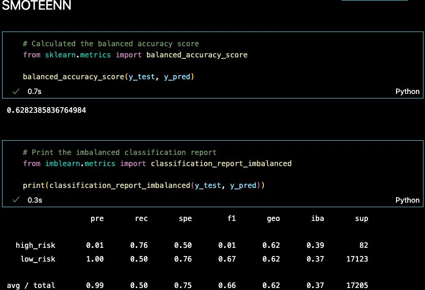
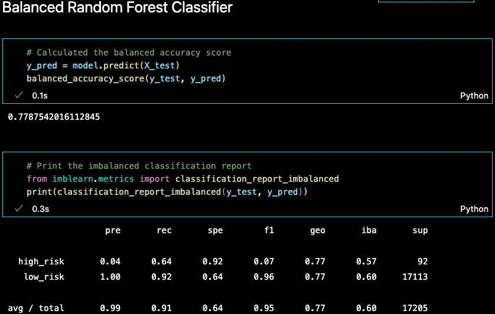
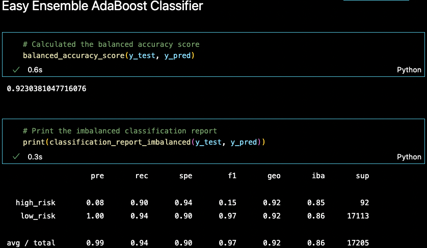

# Overview of Credit Risk Analysis
## The purpose of this analysis is to investigate factors that contribute to high credit risk. Supervised machine learning methods were utilized including resampling models and ensemble techniques like Random Forests and AdaBoost. The efficacy of each model is evaluated according to three metrics: precision (proportion of positive calls that are true positives), and recall (proportion of correctly identified true positives), and balanced accuracy score (the average recall of both credit risk classes).

## Results
### Resampling Methods

* Naive Random Oversampling
  * Balanced Accuracy Score: 0.61
  * Precision: 0.01
  * Recall: 0.57
  * 
* Synthetic Minority Oversampling TechniquE (SMOTE)
  * Balanced Accuracy Score: 0.60
  * Precision: 0.01
  * Recall: 0.52
  * 
* Undersampling with Cluster Centroids Algorithm
  * Balanced Accuracy Score: 0.51
  * Precision: 0.00
  * Recall: 0.55
  * 
* Combined Sampling with SMOTE-Edited Nearest Neighbors (SMOTEENN)
  * Balanced Accuracy Score: 0.63
  * Precision: 0.01
  * Recall: 0.76
  * 

### Ensemble Methods
* Balanced Random Forest
  * Balanced Accuracy Score: 0.78
  * Precision: 0.04
  * Recall: 0.64
  * 
* AdaBoost with EasyEnsemble
  * Balanced Accuracy Score: 0.92
  * Precision: 0.08
  * Recall: 0.90
  * 

## Summary

In summary, none of the models were able to precisely identify high credit risk cases as a result of the imbalance between credit risk classes. The resampling models performed worse than the models based on ensemble techniques. The model with the best performance according to all three metrics was constructed with AdaBoost learners by using the EasyEnsemble algorithm. This model was able to identify 90% of the high credit risk cases (recall = 0.9), though 92% of the positive calls turned out to be incorrect (precision = 0.08). If this model is to be used in practice, it is recommended that all positive calls are further investigated. 